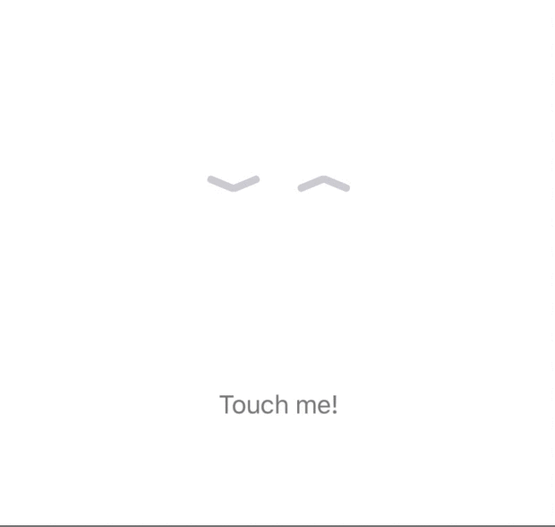
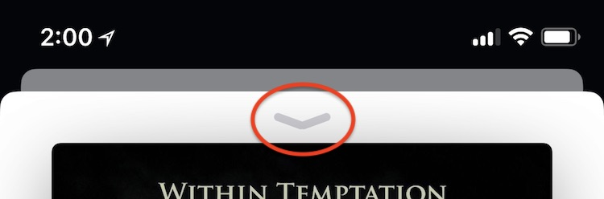

# ButterflyHandle

A handle indicator like iOS Music app.





# Class

- `ButterflyHandleView.swift`

This is a subclass of UIView, the view has only two control methods:

```
func spread(animated: Bool)
func flap(animated: Bool)
```

And the property for direction of arrow:

```
/// `top` or `bottom`
var direction: direction
```
